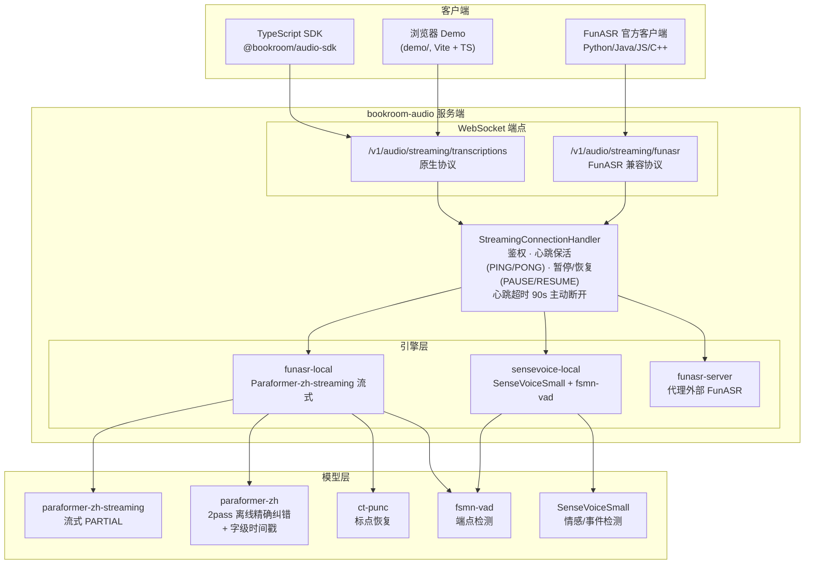

# BookRoom Audio
> 本地语音合成与识别API
>
> API for speech synthesis (TTS) and speech recognition (ASR).

## 使用说明
### 支持OpenAI调用方式

#### 1. **语音转译**
``` js
result = await openai.audio.translations.create({
        file: audioData,
        model,
        language,
        task
    });
```

#### 2. **语音识别**
``` js
result = await openai.audio.transcriptions.create({
    file: audioData,
    model,
    language,
    task
});
```

#### 3. **语音合成**
``` js
// 生成语音
const response = await fetch('http://localhost:15231/v1/tts/generate', {
    method: 'POST',
    headers: {
        'Content-Type': 'application/json',
    },
    body: JSON.stringify({
        text: '你好，这是一个语音合成测试',
        engine: 'chattts',
        language: 'zh'
    })
});
```

### 部署后访问以下地址查看API文档 
#### 1. **Swagger UI(Docs)**
`http://localhost:15231/docs`

#### 2. **ReDoc**
`http://localhost:15231/redoc`

## 🎯 主要功能

### 🔊 语音合成 (TTS)
- **CosyVoice 2 / 3** - 阿里 FunAudioLLM（Apache 2.0 可商用），中文韵律开源第一梯队；CosyVoice3 支持 zero_shot 音色克隆（需参考音频）
- **Kokoro-82M** - hexgrad（Apache 2.0 可商用），text-only 预置音色，82M 极轻量 CPU 可跑，中文 v1.1-zh 优化版；**支持 `return_timestamps` 字级时间戳**（模型原生 `pred_dur` 音素时长），可驱动数智人 viseme 口型（见 docs/INTEGRATION.md §TTS 合成）
- **ChatTTS** - 支持中文语音合成，支持多种情感和音色（**不可商用**，仅作 auto 模式最终兜底）
- **MeloTTS** - 支持中文、英文、日文等多种语言
- **Edge TTS** - 微软在线 TTS（需网络）
- 支持语音和情感选择
- 输出WAV格式音频
- 全部引擎均可商用（除 ChatTTS）：CosyVoice 2/3 + Kokoro 均为 Apache 2.0

### 🎤 语音识别 (ASR)
- **Qwen3-ASR** - 阿里达摩院语音识别模型
- **Whisper** - OpenAI语音识别模型
- 支持多种语言识别
- 支持音频文件上传和流式识别

### 🌊 实时流式语音识别 (Streaming ASR)
基于 WebSocket 的实时流式语音识别，支持三种引擎后端可选：

| 引擎 | 类型 | 特点 |
|------|------|------|
| `funasr-server` | 远程代理 | 连接外部 FunASR `serve_realtime_ws.py` 服务，原生流式，支持多客户端负载 |
| `funasr-local` | 进程内 | 基于 FunASR Paraformer-zh-streaming，分块流式，自带 VAD + 标点；支持 2pass 纠错（FINAL 用 paraformer-zh 整句重识别，纠正同音字错误） |
| `sensevoice-local` | 进程内 | 基于 SenseVoiceSmall，超快推理，支持情感/事件检测，VAD 模拟流式 |

- 支持 VAD 自动端点检测和句子分割
- 支持标点恢复、ITN 数字规整
- 支持热词、说话人分离、情感识别（视引擎能力）
- 支持 PCM/WAV/MP3 等多种音频格式自动转换
- **心跳保活**：客户端 PING → 服务端 PONG（带 RTT 回显）；90s 无任何消息自动断开
- **暂停/恢复**：PAUSE/RESUME 控制音频处理，暂停期间服务端丢弃音频
- **SDK 断线重连**：指数退避自动重连（±25% 抖动），重连后自动重发 START 恢复会话
- WebSocket 协议：START → STARTED → audio frames → PARTIAL/FINAL → STOP → CLOSED

> 协议细节与 SDK 用法见 [docs/INTEGRATION.md](docs/INTEGRATION.md)，服务端配置见 [docs/CONFIGURATION.md](docs/CONFIGURATION.md)。

## 🏗️ 系统架构


```mermaid
flowchart TB
    subgraph 客户端
        SDK["TypeScript SDK<br/>@bookroom/audio-sdk"]
        DEMO["浏览器 Demo<br/>(demo/, Vite + TS)"]
        FUNASR["FunASR 官方客户端<br/>Python/Java/JS/C++"]
    end

    subgraph bookroom-audio 服务端
        subgraph WebSocket 端点
            NATIVE["/v1/audio/streaming/transcriptions<br/>原生协议"]
            COMPAT["/v1/audio/streaming/funasr<br/>FunASR 兼容协议"]
        end

        HANDLER["StreamingConnectionHandler<br/>鉴权 · 心跳保活(PING/PONG) · 暂停/恢复(PAUSE/RESUME)<br/>心跳超时 90s 主动断开"]

        subgraph 引擎层
            FL["funasr-local<br/>Paraformer-zh-streaming 流式"]
            SV["sensevoice-local<br/>SenseVoiceSmall + fsmn-vad"]
            FS["funasr-server<br/>代理外部 FunASR"]
        end
    end

    subgraph 模型层
        M_STREAM["paraformer-zh-streaming<br/>流式 PARTIAL"]
        M_OFFLINE["paraformer-zh<br/>2pass 离线精确纠错<br/>+ 字级时间戳"]
        M_PUNC["ct-punc<br/>标点恢复"]
        M_VAD["fsmn-vad<br/>端点检测"]
        M_SV["SenseVoiceSmall<br/>情感/事件检测"]
    end

    SDK --> NATIVE
    DEMO --> NATIVE
    FUNASR --> COMPAT
    NATIVE --> HANDLER
    COMPAT --> HANDLER
    HANDLER --> FL
    HANDLER --> SV
    HANDLER --> FS
    FL --> M_STREAM
    FL --> M_OFFLINE
    FL --> M_PUNC
    FL --> M_VAD
    SV --> M_SV
    SV --> M_VAD
```

> **2pass 纠错**：`funasr-local` 引擎在 PARTIAL 阶段用流式模型实时输出；会话 STOP 时用 `paraformer-zh` 离线模型对整段音频重新识别（纠正同音字错误）并生成**字级时间戳**，再经 `ct-punc` 加标点输出 FINAL。

### WebSocket 端点
```
ws://<host>:<port>/v1/audio/streaming/transcriptions?token=<api_key>
```

#### 查询可用引擎
```
GET /v1/audio/streaming/engines
```

## 🔧 配置说明

### 默认配置
```bash
# TTS 配置（引擎由请求参数 engine 决定，默认 auto：中文 cosyvoice → kokoro → chattts，英文 pyttsx3）
TTS_ENGINE=chattts
TTS_LANGUAGE=zh

# CosyVoice 2（Apache 2.0 可商用）
COSYVOICE_MODEL_DIR=/app/.cache/cosyvoice-ms/iic/CosyVoice2-0___5B
COSYVOICE_ROOT=/app/.cache/CosyVoice
COSYVOICE_FP16=0

# CosyVoice 3（Apache 2.0 可商用，zero_shot 需参考音频；模型 ~5GB 需下载）
COSYVOICE3_MODEL_DIR=/app/.cache/cosyvoice-ms/FunAudioLLM/Fun-CosyVoice3-0___5B-2512

# Kokoro-82M（Apache 2.0 可商用；权重首次运行自动经 hf-mirror 下载 ~630MB）
KOKORO_HF_HOME=/app/.cache/kokoro-hf
KOKORO_HF_ENDPOINT=https://hf-mirror.com

# ASR 配置  
ASR_ENGINE=qwen-asr
ASR_MODEL=medium
ASR_LANGUAGE=zh
```

### 配置方式
1. **环境变量配置** - 修改 `.env` 文件
2. **命令行参数** - 启动时指定参数
3. **Docker环境变量** - 通过docker-compose配置

## 🛠️ 安装
```bash
# 克隆 GitHub 仓库
git clone https://github.com/sndraw/bookroom-audio.git

# 进入项目目录
cd bookroom-audio

# 如果你还没有安装 uv，请先安装（可能需要需要设置uv到系统环境变量）
pip install uv

# 创建虚拟环境并安装依赖，支持 Python 3.11
uv venv .venv --python=3.11

# 激活虚拟环境
## macOS/Linux
source .venv/bin/activate
## Windows
.venv\Scripts\activate

# 如果需要支持cuda，请参照Nvidia官网说明安装CUDA、cuDNN，并根据所安装版本替换并进行torch等依赖库安装
uv add torch torchvision torchaudio --default-index https://pypi.org/simple --index https://download.pytorch.org/whl/cu126


# 安装所有依赖
uv pip install -e .

# 完成后退出虚拟环境
deactivate
```
## 📚 模型下载（本地模式）

### **推荐使用阿里 ModelScope（国内访问更稳定）**

```bash
# 设置环境变量
export HF_ENDPOINT=https://www.modelscope.cn

# 下载 ChatTTS 模型（推荐）
huggingface-cli download 2Noise/ChatTTS

# 下载 CosyVoice 2 模型（Apache 2.0 可商用；详见 MODEL_DOWNLOAD.md）
python -c "from modelscope import snapshot_download; snapshot_download('iic/CosyVoice2-0.5B', local_dir='./docker-deploy/.cache/cosyvoice-ms/iic/CosyVoice2-0___5B')"

# 下载 CosyVoice 3 模型（Apache 2.0 可商用，~5GB，zero_shot 需参考音频）
python -c "from modelscope import snapshot_download; snapshot_download('FunAudioLLM/Fun-CosyVoice3-0.5B-2512', local_dir='./docker-deploy/.cache/cosyvoice-ms/FunAudioLLM/Fun-CosyVoice3-0___5B-2512')"

# 下载 Qwen3-ASR 模型
huggingface-cli download Qwen/Qwen3-ASR-1.7B

# 下载 Whisper 模型（⚠️ 必须手动下载，禁止自动下载）
# 使用阿里 ModelScope（国内推荐）
HF_ENDPOINT=https://www.modelscope.cn huggingface-cli download openai/whisper-medium
# 或使用官方 Hugging Face（国外）
# HF_ENDPOINT=https://huggingface.co huggingface-cli download openai/whisper-medium

# 下载 MeloTTS 中文模型
huggingface-cli download myshell-ai/MeloTTS-Chinese
```

> 💡 **Kokoro-82M**（Apache 2.0 可商用）无需手动下载：首次调用 `engine=kokoro` 时自动经 `KOKORO_HF_ENDPOINT`（默认 hf-mirror.com）下载权重（v1.0 + v1.1-zh 各 ~312MB）到 `KOKORO_HF_HOME`。

### **ModelScope 模型地址汇总**
| 模型 | ModelScope 地址 | 说明 |
|------|----------------|------|
| ChatTTS | https://www.modelscope.cn/models/2Noise/ChatTTS | 高质量中文语音合成（不可商用） |
| CosyVoice2-0.5B | https://www.modelscope.cn/models/iic/CosyVoice2-0.5B | CosyVoice 2（Apache 2.0 可商用） |
| Fun-CosyVoice3-0.5B-2512 | https://www.modelscope.cn/models/FunAudioLLM/Fun-CosyVoice3-0.5B-2512 | CosyVoice 3（Apache 2.0 可商用，~5GB） |
| Qwen3-ASR-1.7B | https://www.modelscope.cn/models/Qwen/Qwen3-ASR-1.7B | 阿里语音识别模型 |
| whisper-medium | https://www.modelscope.cn/models/openai/whisper-medium | OpenAI 官方 Whisper（推荐） |
| MeloTTS-Chinese | https://www.modelscope.cn/models/myshell-ai/MeloTTS-Chinese | 多语言语音合成 |

### **国际模型仓库下载**
```bash
# 设置环境变量
export HF_ENDPOINT=https://huggingface.co

# 下载模型
huggingface-cli download 2Noise/ChatTTS
huggingface-cli download Qwen/Qwen3-ASR-1.7B
huggingface-cli download openai/whisper-medium  # OpenAI 官方版本，无广告
```

## 🚀 启动
### **设置环境变量**
在项目根目录下复制``.env.example并重命名为 .env，并根据需要修改环境变量。
   
```bash
API_KEY=your_api_key_here # 你的 API 密钥，如果没有可以不填
# MODEL=本地下载模型绝对路径 # 如果仅使用本地下载模型，请填写本地绝对路径覆盖默认值
MODEL=medium # 模型大小，可选：medium, large, xlarge 等，默认为 medium
DEVICE=cpu # 设备支持：可选，默认为 cpu, 支持cpu、cuda、auto
COMPUTE_TYPE=int8 # 计算类型，默认为 int8, 支持 int8, int4, bfloat16 等
MODEL_KEEP_ALIVE=5m # 模型保持时间，默认为5分钟，如果为-1则为无限期保持
NUM_WORKERS=1 # 工作线程数，默认为1个
DOWNLOAD_ROOT=./cache # 下载模型等文件的缓存路径
LOCAL_FILES_ONLY=true # 是否只使用本地文件，不从网络下载，默认为true
HF_ENDPOINT=https://www.modelscope.cn # 模型仓库地址，默认为 https://huggingface.co
```


### **启动服务**
```bash
# 正常运行模式
uv run -m bookroom_audio.server

# 开启调试模式，代码修改后自动重启服务
uv run -m bookroom_audio.server --reload
```

### **Docker Compose 部署（推荐）**

使用 docker-compose 可以更方便地管理服务，并避免每次启动重新下载依赖：

```bash
# 首次构建并启动
make rebuild

# 停止服务
make down

# 启动服务（不会重新构建）
make up

# 查看日志
make logs
```

依赖会在构建时打包到镜像中，容器重启时不会重新下载。


## Docker打包
### 1. 登录镜像仓库（可选）
```bash
docker login -u username <IP:port>/<repository>
```
### 2. 构建镜像

#### make命令（参数可选）
注：Makefile中定义了build-push-all目标，可以一次性构建并推送镜像
```bash
make build-push-all REGISTRY_URL=<IP:port>/<repository> IMAGE_NAME=sndraw/bookroom-audio IMAGE_VERSION=0.0.1
```

### 3. Docker Compose 部署（推荐）

项目提供了 docker-compose.yml 配置文件，可以更方便地管理服务：

```bash
# 首次构建并启动（依赖会打包到镜像中）
make rebuild

# 之后重启不会重新下载依赖
make down
make up

# 查看实时日志
make logs
```

**优势**：
- 依赖在构建时打包到镜像中，容器重启时不会重新下载
- 利用 Docker 层缓存，代码修改后构建速度更快
- 统一管理容器生命周期

## 截图展示
### 接口配置
  
### 模型设置
  
### 语音识别
