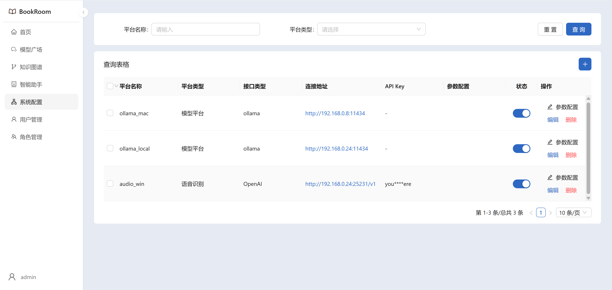
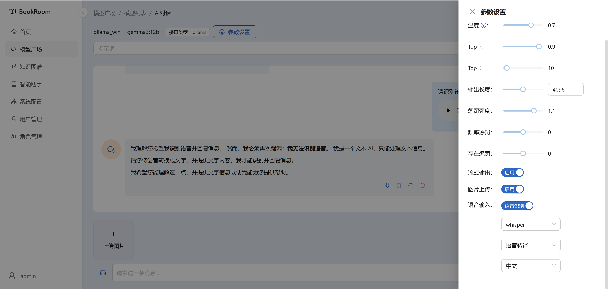
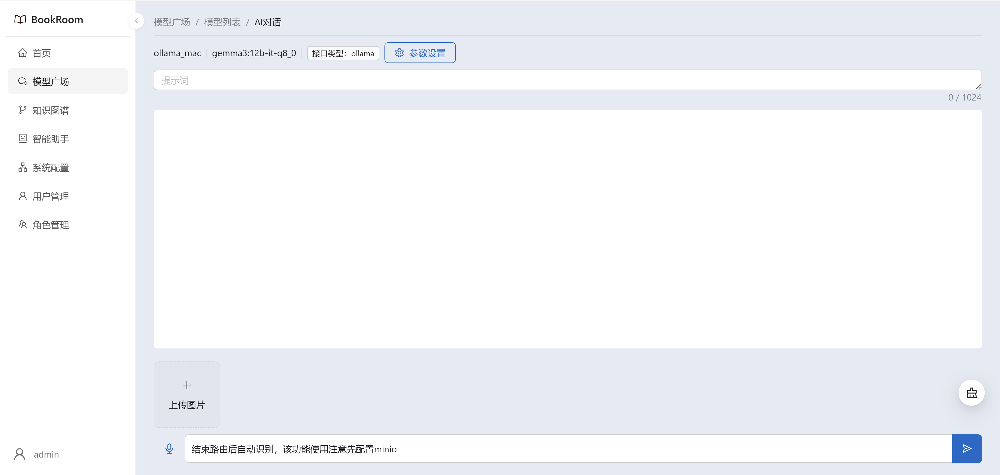

# BookRoom Audio
> 本地语音识别API
>
> API for translating audio to text using Whisper model.

## 使用说明
### 支持OpenAI调用方式
#### 1. **语音转译**
``` js
result = await openai.audio.translations.create({
        file: audioData,
        model,
        language,
        task
    });
```

#### 2. **语音识别**
``` js
result = await openai.audio.transcriptions.create({
    file: audioData,
    model,
    language,
    task
});
```

### 部署后访问以下地址查看API文档 
#### 1. **Swagger UI(Docs)**
`http://localhost:15231/docs`

#### 2. **ReDoc**
`http://localhost:15231/redoc`

## 🛠️ 安装
```bash
# 克隆 GitHub 仓库
git clone https://github.com/sndraw/bookroom-audio.git

# 进入项目目录
cd bookroom-audio

# 如果你还没有安装 uv，请先安装（可能需要需要设置uv到系统环境变量）
pip install uv

# 创建虚拟环境并安装依赖，支持 Python 3.11
uv venv .venv --python=3.11

# 激活虚拟环境
## macOS/Linux
source .venv/bin/activate
## Windows
.venv\Scripts\activate

# 如果需要支持cuda，请参照Nvidia官网说明安装CUDA、cuDNN，并根据所安装版本替换并进行torch等依赖库安装
uv add torch torchvision torchaudio --default-index https://pypi.org/simple --index https://download.pytorch.org/whl/cu126


# 安装所有依赖
uv pip install -e .

# 完成后退出虚拟环境
deactivate
```
## 📚 模型下载（本地模式）
### **国内模型仓库下载**
```bash
# Make sure git-lfs is installed (https://git-lfs.com)
git lfs install

git clone https://hf-mirror.com/guillaumekln/faster-whisper-medium
```
### **国际模型仓库下载**
```bash
# Make sure git-lfs is installed (https://git-lfs.com)
git lfs install
git clone https://huggingface.co/Systran/faster-whisper-medium
```

## 🚀 启动
### **设置环境变量**
在项目根目录下复制``.env.example并重命名为 .env，并根据需要修改环境变量。
   
```bash
API_KEY=your_api_key_here # 你的 API 密钥，如果没有可以不填
# MODEL=本地下载模型绝对路径 # 如果仅使用本地下载模型，请填写本地绝对路径覆盖默认值
MODEL=medium # 模型大小，可选：medium, large, xlarge 等，默认为 medium
DEVICE=cpu # 设备支持：可选，默认为 cpu, 支持cpu、cuda、auto
COMPUTE_TYPE=int8 # 计算类型，默认为 int8, 支持 int8, int4, bfloat16 等
MODEL_KEEP_ALIVE=5m # 模型保持时间，默认为5分钟，如果为-1则为无限期保持
NUM_WORKERS=1 # 工作线程数，默认为1个
DOWNLOAD_ROOT=./cache # 下载模型等文件的缓存路径
LOCAL_FILES_ONLY=true # 是否只使用本地文件，不从网络下载，默认为true
```


### **启动服务**
```bash
# 正常运行模式
uv run -m bookroom_audio.server

# 开启调试模式，代码修改后自动重启服务
uv run -m bookroom_audio.server --reload
```


## Docker打包
### 1. 登录镜像仓库（可选）
```bash
docker login -u username <IP:port>/<repository>
```
### 2. 构建镜像

#### make命令（参数可选）
注：Makefile中定义了build-push-all目标，可以一次性构建并推送镜像
```bash
make build-push-all REGISTRY_URL=<IP:port>/<repository> IMAGE_NAME=sndraw/bookroom-audio IMAGE_VERSION=0.0.1
```

## 截图展示
### 接口配置
  
### 模型设置
  
### 语音识别
  